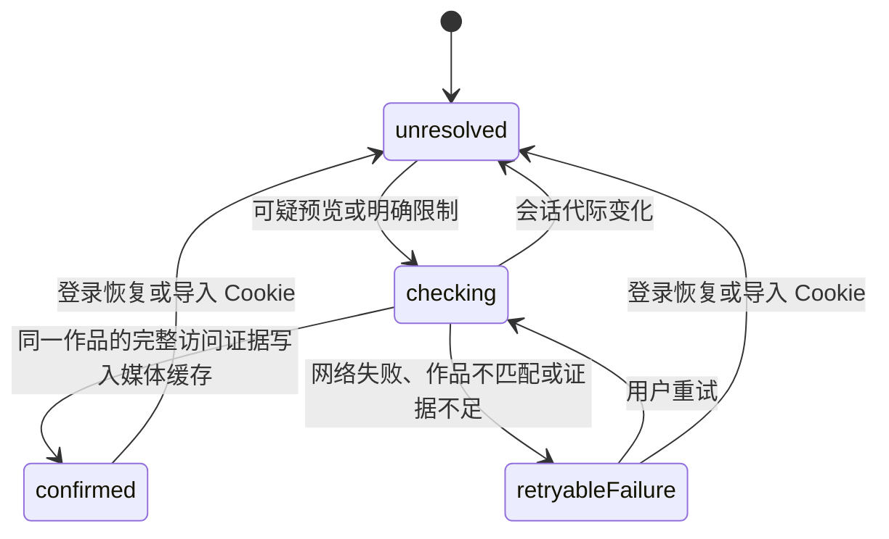

# 作品访问状态与媒体解析

同一作品从更多推荐和作者页打开时，数据源可能不同。应用必须保留访问原因，核对当前账号的权限，并让卡片、详情和缓存使用同一结果。

## 独立状态

| 维度 | 状态或事实 | 用途 |
| --- | --- | --- |
| 内容标记 | `isMature` | 说明作品包含成年内容，不说明付费或 Cookie 失效 |
| 预览 | `missing`、`blurred`、`clear` | 记录媒体响应；清晰缩略图不自动解除访问限制 |
| 限制原因 | 成年内容需登录、购买、订阅、封锁、删除、登录、未知 | 使用集合，允许成年内容和付费限制同时存在 |
| 解析阶段 | `unresolved`、`checking`、`confirmed`、`retryableFailure` | 管理请求与重试，不生成认证结论 |
| 网页会话 | `WebSessionStatusState` | 由独立验证器产生，决定是否显示恢复登录提醒 |

`ArtworkAccessEvidence` 保留来源、限制集合、未知原因码和媒体状态。来源分为映射后的列表、网站原始列表、网页完整详情和官方 OAuth 详情。解析器目前明确识别 `mature_loggedout`、购买访问字段、订阅层级及封锁／删除字段。其余原因码保留为未知；模型中的浏览设置限制只接受明确证据，当前不根据未知原因码推断这一状态。

## 解析阶段转换

记录完整详情的证据不会单独把阶段改为 `confirmed`。身份匹配、证据足够明确且媒体成功写入缓存后，才确认解析完成。否则保留原预览与访问限制。

## 来源与访问范围

主图优先使用明确的官方 OAuth 详情证据，随后是明确的网页完整详情，最后才使用列表线索。缺少媒体、仍然模糊且没有明确访问原因的详情不能证明可查看。官方接口查询失败时，可使用作者和作品路径均匹配的完整网页详情；不修改 CDN URL 来消除模糊。

OAuth 主图访问与网页附加图片访问分别保留。官方接口给出清晰主图时，网页的 `mature_loggedout` 证据仍保留在网页访问范围内，不能据此宣称附加图片也可访问。付费限制与成年内容登录限制同时出现时，两项原因都保留。

已确认媒体不会被之后重新写入的稀疏列表覆盖。卡片同时读取作品缓存与访问状态，防止出现“锁已消失、图片仍模糊”的中间结果。

## Cookie 恢复与旧请求

明确的登录限制，或原因不明的模糊预览，可以请求网页会话复核。明确的纯付费限制不单独触发 Cookie 检查。内容证据不写网页认证状态；验证器确认匿名后才显示重新登录提醒，网络与验证页面继续按原规则退避。

确认网页登录恢复或成功导入 Cookie 后，应用重置访问证据代际，并使相关详情和媒体 Provider 失效。导入 Cookie 还会请求服务端复核，读取本地 Cookie 不等于确认会话健康。在途请求带有启动时的代际；结果与当前代际不同就不能更新证据、媒体缓存或解析阶段。

## 代码职责与验证

- `artwork_web_repository.dart`：沿用 SDK 的作品解析，补充保留网站原始访问原因。
- `artwork_access_state.dart`：证据模型、来源优先级、范围与访问判断。
- `artwork_access_controller.dart`：解析阶段、会话代际与过期结果拒绝。
- `artwork_store.dart`：合并媒体与访问限制，保护已确认媒体。
- `artwork_detail_providers.dart`：请求编排、官方／网页回退、恢复时的缓存失效。
- `artwork_access_presentation.dart`：把原因转成文案和图标。未知原因、NSFW 登录限制、付费限制分别展示。

回归测试覆盖组合限制、未知原因码、两种网站页面格式、主图与附加图片的权限边界、旧会话结果、网页详情回退和卡片同步更新。实际作品的服务端响应验证范围见 [REG-013](../regressions/013-mature-related-preview.md)。
